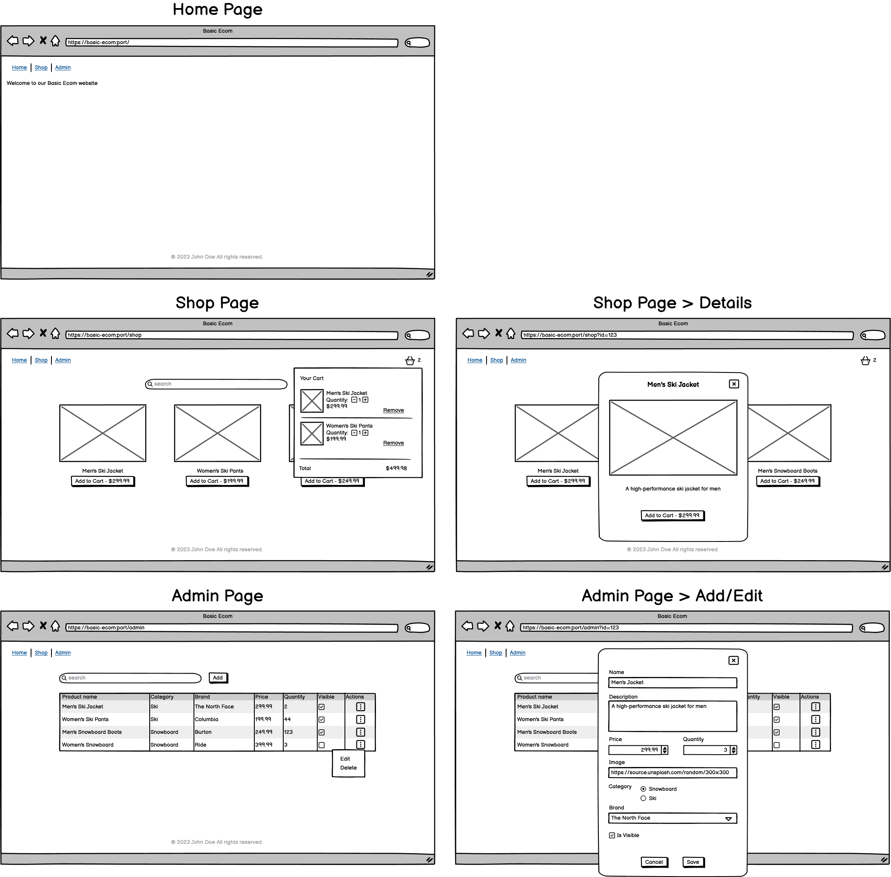

# mts-basic-shop-react-starter

A basic shop React project. Simple home page with navigation. A shop page for users listing all available items, with search functionality and a cart functionality. An admin page for maintainers listing all items, with search functionality and the ability to add, edit, change the availability of an item and delete items.

Here is a rough wireframe of the projects design



## Technologies

- [Git](https://git-scm.com/) - Version control system
- [Node](https://nodejs.org/en) - Runtime
- [NPM](https://www.npmjs.com/) - Package manager
- [Vite](https://vitejs.dev/) - Bundler
- [React](https://react.dev/) - Framework
- [Typescript](https://www.typescriptlang.org/) - Static types
- [ESLint](https://eslint.org/) - Linter
- [Prettier](https://prettier.io/) - Formatter
- [Husky](https://typicode.github.io/husky/) - Git hook helper
- [Commitlint](https://commitlint.js.org/) - Lint commit messages
- [Conventional Commits](https://www.conventionalcommits.org/en/v1.0.0-beta.2/) - Specification for commit messages
- [Lint Staged](https://github.com/okonet/lint-staged/) - Run linters and formatters against staged git files
- [Tailwindcss](https://tailwindcss.com/) - Styling
- [SVGR](https://www.npmjs.com/package/vite-plugin-svgr) - SVG Loader
- [React Router](https://reactrouter.com/en/main/) - Routing
- [JSON server](https://github.com/typicode/json-server) - Server and Database
- [Concurrently](https://github.com/open-cli-tools/concurrently) - Run multiple commands concurrently

## Installation

Clone repo and cd into project

```sh
$ git clone git@github.com:nenadpejic/mts-basic-shop-react-starter.git
$ cd mts-basic-shop-react-starter
```

Make sure to use the node version specified in `.nvmrc`. It is recommended to use `nvm` for node version management. [Official nvm docs](https://github.com/nvm-sh/nvm/blob/master/README.md)

```sh
$ nvm use
```

Intall dependencies. This project uses npm.

```sh
$ npm install
```

## Development

Run the json server

```sh
$ npm run server
```

Run local dev server

```sh
$ npm run dev
```

Or run both json and local dev server concurrently

```sh
$ npm start
```

## Build and Test

Bundle for production

```sh
$ npm run build
```

## Contributing

Create a new feature branch

```sh
$ git checkout -b feat/<feature-name>
```

Commit messages need to follow [Conventional Commits](https://www.conventionalcommits.org/en/v1.0.0/)

```sh
$ git add .
$ git commit -m '<type>[optional scope]: <description>'
```

Open a pull request and once approved merge by squashing commits

Optional: Rebase beforehand

```sh
$ git rebase master HEAD~<number-of-commits> -i
```
